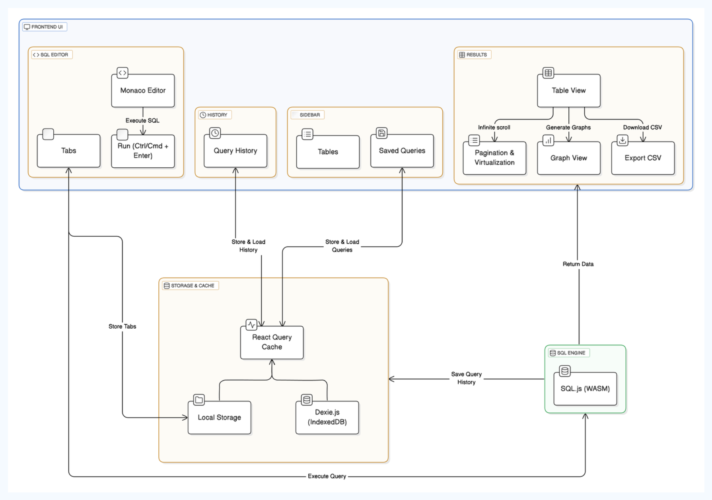
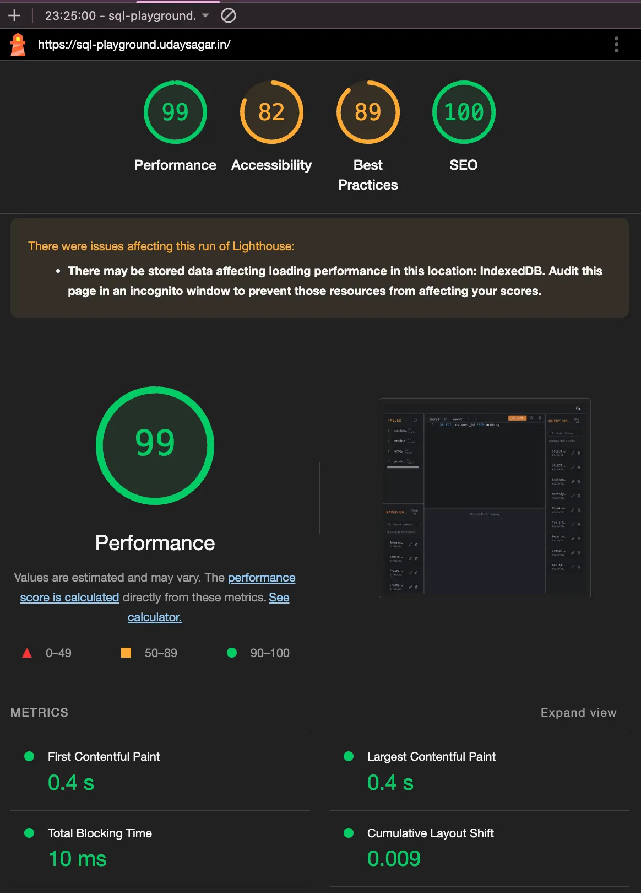

# SQL Playground

**Try the Demo:** [https://sql-playground.udaysagar.in/](https://sql-playground.udaysagar.in/)

## Overview

SQL Playground is a high-performance, in-browser SQL execution tool built with [Next.js](https://nextjs.org/). Designed to efficiently handle millions of rows, it leverages WebAssembly-based [SQL.js](https://sql.js.org/) for query execution and [IndexedDB](https://developer.mozilla.org/en-US/docs/Web/API/IndexedDB_API) for data persistence. Optimized to prevent unnecessary re-renders, it is designed for seamless future integration with any backend.

## Architecture Overview

### Core Technologies

- **[Next.js](https://nextjs.org/)**: Frontend framework for UI development.
- **[SQL.js](https://sql.js.org/)**: Enables in-browser SQL execution.
- **[Dexie.js](https://dexie.org/) (IndexedDB)**: Stores query history and saved queries locally.
- **[React Query](https://tanstack.com/query/latest)**: Manages state, caching, and background updates.
- **[React-Virtuoso](https://virtuoso.dev/)**: Implements virtualized rendering for efficient handling of large datasets.
- **[Monaco Editor](https://microsoft.github.io/monaco-editor/)**: Provides a powerful SQL code editor.

### Data Flow

1. **Initial Load**:
   - Initializes the SQL.js instance.
   - Loads predefined mock tables into SQL.js.
   - Retrieves saved queries, query history from IndexedDB, and tabs from local storage.
2. **Query Execution**:
   - The user enters an SQL query.
   - SQL.js executes the query.
   - Results are paginated and displayed in a virtualized table.
   - The query is stored in history within IndexedDB, updating the query history.
   - If the query modifies the database schema (DDL/DML), the table list is re-rendered.
3. **Data Persistence**:
   - IndexedDB stores saved queries and query history.
   - Local Storage retains tab states.
   - SQL.js maintains in-memory tables, resetting upon page reload.
   - React Query manages state, caching, and background updates.

### System Architecture Diagram



## Key Features

- **In-browser SQL query execution** with SQL.js.
- **Pagination & Virtualized Rendering**: Ensures smooth interaction with large datasets.
- **Debounced Search**: Prevents unnecessary query execution while typing.
- **Infinite Scrolling**: Efficiently handles large lists of queries and history.
- **Multi-Tab Query Editor**: Powered by Monaco Editor, with quick-run functionality (Ctrl/Cmd + Enter).
- **Table Descriptions**: Displays row counts and column data types.
- **Query History & Saved Queries**: Enables easy reference and reuse.
- **Charts for Data Analysis**.
- **Dark Mode Support**: Enhances user experience.
- **Responsive Design**: Ensures usability across devices.

## Performance Optimizations

- **Virtualized Rendering**: Uses [React-Virtuoso](https://virtuoso.dev/) for efficient large dataset rendering.
- **State Management**: [React Query](https://tanstack.com/query/latest) minimizes unnecessary re-renders and enhances caching.
- **Debounced Search**: Reduces redundant queries while typing.
- **Infinite Scrolling**: Uses `Intersection Observer` for seamless cursor-based pagination.
- **Optimized Table Rendering**: Re-renders only when schema changes occur.
- **Reduced Bundle Size**: Implements code splitting for optimal performance.
- **Background Initialization**: Loads SQL.js during startup for better responsiveness.
- **Lazy Loading**: Uses `lazy()` and `Suspense` to load non-critical components asynchronously.
- **Optimized Re-renders**: Utilizes `useMemo` and `useCallback` to prevent unnecessary updates.
- **Reusable Components**: Enhances maintainability and performance.
- **Lazy Tab Loading**: No tabs are created by default to avoid rendering the editor component, significantly improving initial load time.

## Project Structure

```
src/
├── actions/      # Business logic and database interactions
├── api/          # Hooks for data fetching and API communication
├── components/   # Modular UI components
├── hooks/        # Custom React hooks
├── lib/          # Utility functions and core configurations
├── mock/         # Predefined mock data and table structures
├── providers/    # React context providers
├── app/          # Core application components and pages
├── styles/       # Global and module-specific styles
└── types/        # TypeScript type definitions
```

## Tools Used for Performance Measurement

- **[React Scan](https://react-scan.com/)**: Analyzes component rendering performance.
- **[Lighthouse](https://developer.chrome.com/docs/lighthouse/overview/)**: Evaluates accessibility, performance, and SEO.
- **[GTmetrix](https://gtmetrix.com/)**: Measures load times and best practices.
- **[Chrome DevTools](https://developer.chrome.com/docs/devtools/)**: Identifies and debugs performance bottlenecks.

## Performance Benchmarks

| Metric                         | Value |
| ------------------------------ | ----- |
| First Contentful Paint (FCP)   | 0.2s  |
| Largest Contentful Paint (LCP) | 0.6s  |
| Total Blocking Time (TBT)      | 0ms   |
| Cumulative Layout Shift (CLS)  | 0     |
| Speed Index                    | 0.2s  |
| Performance Score              | 100   |
| Accessibility Score            | 100   |
| Best Practices Score           | 100   |
| SEO Score                      | 100   |

### Performance Metrics Visualization


